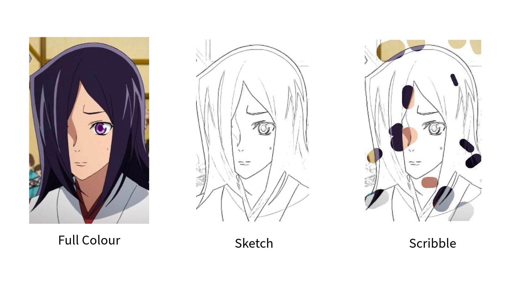

<h1> Diffusart-pytorch</h1>

## 1. About the project

The project's goal is to develop a neural network, that given an black and white
sketch of an image, and some partial information about the image, can generate
a full color image.

  

We are using a medium sized dataset of around 40000 images, taken from various anime
(see <a href='https://huggingface.co/datasets/pawlo2013/anime_diffusion_full'> Dataset </a>).
The main source of inspiration (architecture and approach) was the paper <a href='https://openaccess.thecvf.com/content/CVPR2023W/CVFAD/papers/Carrillo_Diffusart_Enhancing_Line_Art_Colorization_With_Conditional_Diffusion_Models_CVPRW_2023_paper.pdf'> Diffusart: Enhancing Line Art Colorization with Conditional Diffusion Models </a>. The architecture was a direct copy of the implementation of the paper by <a href='https://arxiv.org/pdf/2006.11239.pdf' > Ho et al. </a>, throught the code implementation by <a href='https://huggingface.co/blog/annotated-diffusion'> Niels Rogge and Kashif Rasul </a>.

## 2. How to run the code

The main training loop is under train.py, and all of the config files are in the config.yaml.
The dataset that is to be used for the task is assumed to have three columns where each row represents a training triplet. The columns are "full_colour", "sketch", "sketch_and_scribbles_merged". Look at <a href='https://huggingface.co/datasets/pawlo2013/anime_diffusion_full'> Dataset </a>, for an example training dataset.

## 3. Overview of the model

  
   
 <a href="https://www.tldraw.com/s/v2_c_8OhQWiVZiwMq1-VbE-bza?viewport=-2233,-1032,7715,4420&page=page:page" target="_blank"> Link to higher resolution version</a>

The model uses a Unet architecture. The explicit conditional information is concataned to the noisy input, and the implicit partial colour information is introdcued via cross attention.

## 4. Evaluation

  <video src="./examples/output.mp4" height="500px" width="500px" />

  <video src="./examples/model_predictions.png" height="500px" width="500px" />

Training of the model took around 80h of compute on single RTX 3090 chip. The averege LPIPS score on the test set (300 examples) measured to be 0.1632.

## 5. Notes

This is still just a rough implementation of the ideas mentioned in the original Diffusart paper, and as such, it may contain some bugs and errors. You are welcome to propose any changes via github.
